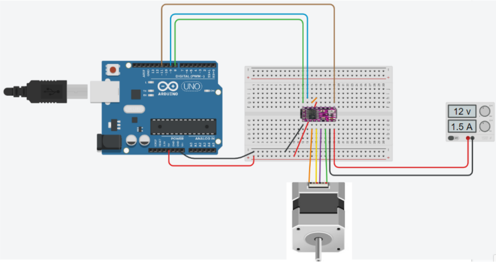

# Syringe_Pump
Projeto desenvolvido para a disciplina de engenharia unificada II para construir uma Bomba de seringa (syringe pump), que é um equipamento dosador de líquidos que trabalha com pequenas vazões de forma precisa, para ser aplicado principalmente em laboratórios. As peças do suporte foram modeladas e impressas em uma impressora 3d e para a parte eletônica foi feito um projeto em arduino.

Mais informações podem ser encontradas no site criado para a matéria: https://syringe-pump-ufabc.jimdosite.com/

